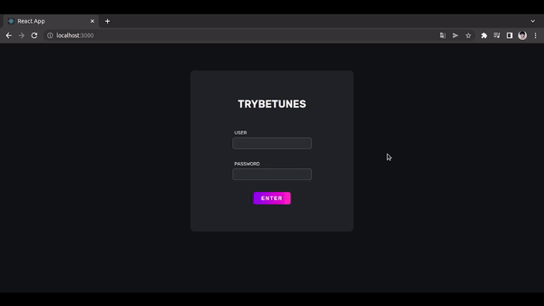

<h1 align="center">🎵 TrybeTunes</h1>
<h3 align="center">Music Streaming</h3>

Trybetunes is a music streaming, where the client is able to search, listen and favorite their songs. In this project, I used data from iTunes’s APIs, keeping your library always up to date. I developed this project through Trybe course, in Front End module. By the way, I want to give credits to Trybe for giving the functions on services directory, thanks!

  

<h3 align="left">Skills</h3>

- Make requests from an API
- React component lifecycles
- Local State
- BrowserRouter, React Router, Route, Switch
- Redirect
- Link

<h3 align="left">Connect with me</h3>

<h3 align="left">Languages and Tools</h3>

        

